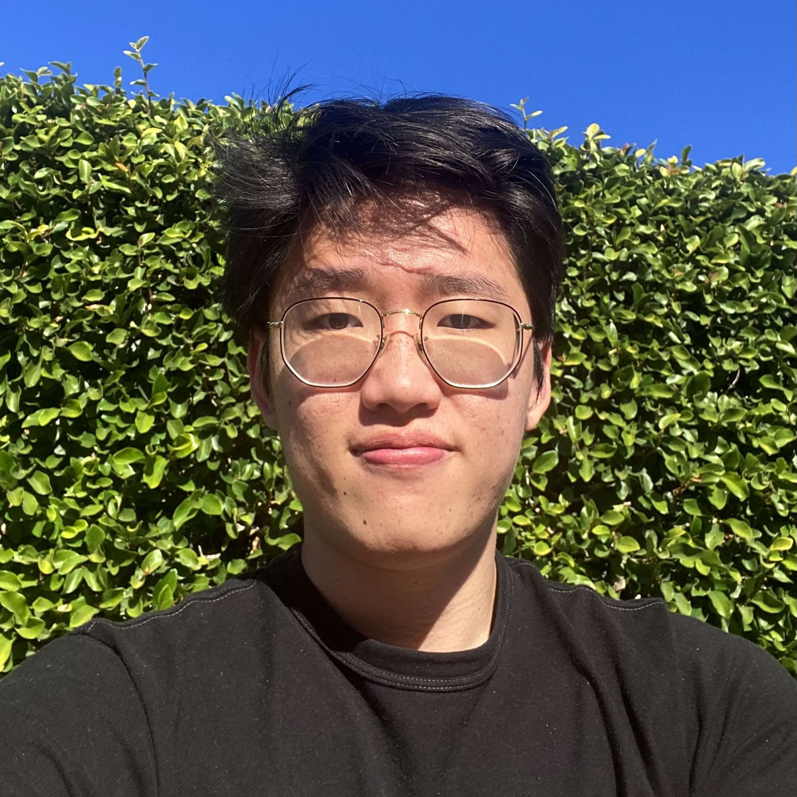

Hi, I am Xiaorui! I am an incoming computer science PhD student at the University of Pennsylvania. Advised by [Andrew Head](https://andrewhead.info), my research lies at the intersection of human-computer interaction and programming languages. My current technical work is centered around [Property-Based Testing](https://www.youtube.com/watch?v=ujrpY3ct_BA). More generically, I want to understand how to make programming more usable! 

Previously, I was an undergraduate at the University of California, Berkeley, where I studied computer science, data science, and history, with a minor in digital humanities. My data science concentration was geospatial information and technology, and my history concentration was in the history of science. At the start of my research journey in Berkeley, I was very fortunate to be advised by [Sarah Chasins](https://schasins.com/) and was a part of [PLAIT Lab](https://plait-lab.org/). There, I did a mixed bag of projects at the intersection of PL + HCI, which included a Python eDSL for generating data transformation GUIs and a study on facilitating program generation for Arduino users. I am forever grateful for all the kind people in PLAIT who inspired me to do this research thing.  

For some fun additional background, I wrote my history thesis on the trajectory of industrial research labs, specifically IBM's, in the 1990s. Amongst other escapades, I also wrote a substantial research paper on [numerical taxonomy](https://en.wikipedia.org/wiki/Numerical_taxonomy) and essentialism in the mid-20th century. I very much enjoy reading and hope to engage with ideas found in STS, intellectual history, and critical theory.  

Outside of my studies, I am very proud to have taught as an undergraduate for many semesters. I also had the pleasure of working in the [Human Contexts and Ethics](https://cdss.berkeley.edu/dsus/human-contexts-and-ethics) team at Berkeley, creating content that integrated real data and ethical considerations into various core data science courses. In my free time, I enjoy cooking/baking and casually playing video games.

(This website is forked from [this repo](https://github.com/harinisuresh/harinisuresh.github.io/tree/gh-pages), which is forked from [this repo](https://github.com/ankitsultana/researcher).)
